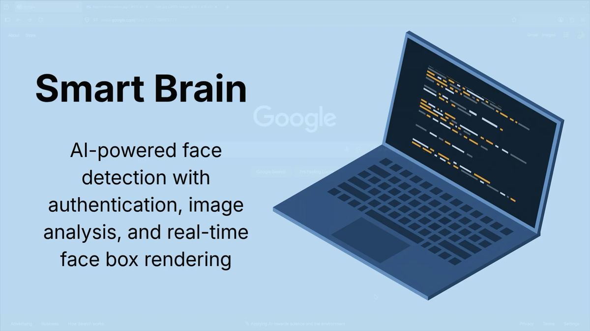

# Smart Brain

A full-stack face detection application that uses AI to identify faces in images, with real-time visual feedback and persistent user tracking.

- 👉 **Frontend Repo:** [smart-brain](https://github.com/brandonmay-dev/smart-brain)
- 👉 **Backend API:** [smart-brain-api](https://github.com/brandonmay-dev/smart-brain-api)
- 👉 **Live Demo:** [smart-brain-app-32fac457676f.herokuapp.com](https://smart-brain-app-32fac457676f.herokuapp.com/)

---

## Walkthrough

Watch the project walkthrough on Vimeo:

[](https://vimeo.com/1188742900)

---

## Why This Project Stands Out

This isn’t just a UI demo — it demonstrates full-stack development across the entire request lifecycle:

- Building a responsive React frontend
- Designing and consuming RESTful APIs
- Implementing authentication flows
- Persisting user data with PostgreSQL
- Integrating a third-party AI service (Clarifai)
- Managing environment-based configuration for deployment

---

## Key Highlights

- Real-time face detection using an external AI model
- Full authentication system with persistent user tracking
- End-to-end data flow: client → server → third-party API → UI
- Dynamic bounding box rendering based on image analysis
- Separation of concerns between frontend and backend services

---

## What The App Does

- Users can register and sign in securely
- Submit an image URL for processing
- Detect a face within the image using AI
- Render a bounding box around the detected face
- Track how many images each user has processed

---

## Tech Stack

### Frontend

- **React 19** – component-based UI and state management
- **Vite** – fast development server and optimized builds
- **JavaScript (ES6+)**
- **Tachyons** – utility-first CSS for rapid styling
- `particles-bg`, `react-parallax-tilt` – UI enhancements

### Backend

- **Node.js + Express** – REST API and server logic
- **PostgreSQL** – relational database for user data
- **Knex** – SQL query builder
- **bcryptjs** – password hashing and authentication

### External Service

- **Clarifai API** – face detection model

---

## Request Flow (How It Works)

1. User submits credentials or an image URL
2. Backend validates request and interacts with PostgreSQL
3. Image URL is sent to Clarifai for face detection
4. Clarifai response is returned to the backend
5. Frontend calculates bounding box coordinates
6. UI renders detected face and updates user entry count

---

## API Endpoints

- `POST /register` – create new user
- `POST /signin` – authenticate user
- `POST /imageurl` – process image via Clarifai
- `PUT /image` – update user entry count
- `GET /profile/:id` – retrieve user profile

---

## Running Locally

### 1. Start the Backend

```bash
cd ../smart-brain-api
npm install
```

Create `.env`:

```env
CLARIFAI_PAT=your_clarifai_pat
DB_HOST=127.0.0.1
DB_PORT=5432
DB_NAME=smart-brain
DB_USER=your_postgres_user
DB_PASSWORD=your_postgres_password
PORT=3001
```

Run:

```bash
npm run dev
```

---

### 2. Start the Frontend

```bash
npm install
```

Create `.env`:

```env
VITE_API_URL=http://localhost:3001
```

Run:

```bash
npm run dev
```

---

## What This Project Demonstrates

- Full-stack application architecture (client + server separation)
- Authentication and secure password handling
- Database integration and persistent state
- Third-party API integration and data transformation
- Translating backend data into dynamic UI visuals
- Environment configuration for local and deployed setups

---

## Future Improvements

- Add screenshots or demo GIF for quick visual context
- Deploy frontend + backend for live demo
- Add loading, empty, and error states
- Support multiple face detections per image
- Add automated tests for auth and API flows
- Document database schema and migrations

---

## About Me

I’m a full-stack developer focused on building real-world applications that integrate APIs, databases, and modern frontend frameworks.

I’m actively seeking **junior full-stack, frontend, or software engineering roles (remote-friendly)**.

👉 Let’s connect on LinkedIn
👉 Explore more projects on my GitHub
